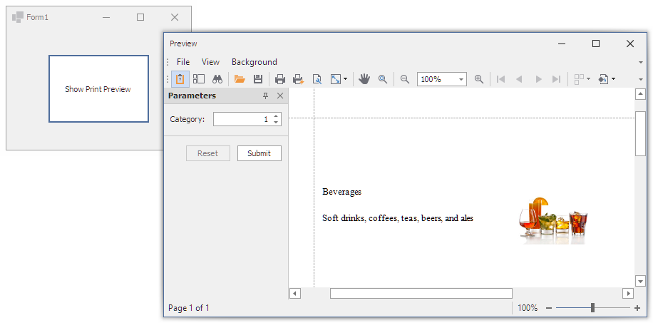

<!-- default badges list -->

<!-- default badges end -->
# Reporting for WinForms - Add Parameters to Report at Runtime

This example shows how to create a [report parameter](https://docs.devexpress.com/XtraReports/9997/detailed-guide-to-devexpress-reporting/use-report-parameters/create-a-report-parameter), and pass it to a report at runtime.

## Files to Look At:

* [Form1.cs](./CS/ReportParameterExample/Form1.cs) (VB: [Form1.vb](./VB/ReportParameterExample/Form1.vb))

## Documentation

- [Use Report Parameters](https://docs.devexpress.com/XtraReports/4812/detailed-guide-to-devexpress-reporting/use-report-parameters)
## More Examples

- [Reporting for WinForms - Implement a Custom Parameter Editor](https://github.com/DevExpress-Examples/reporting-winforms-implement-custom-parameter-editor)
- [How to Create a Drill-Through Report](https://github.com/DevExpress-Examples/Reporting_how-to-create-a-drill-through-report-e875)

